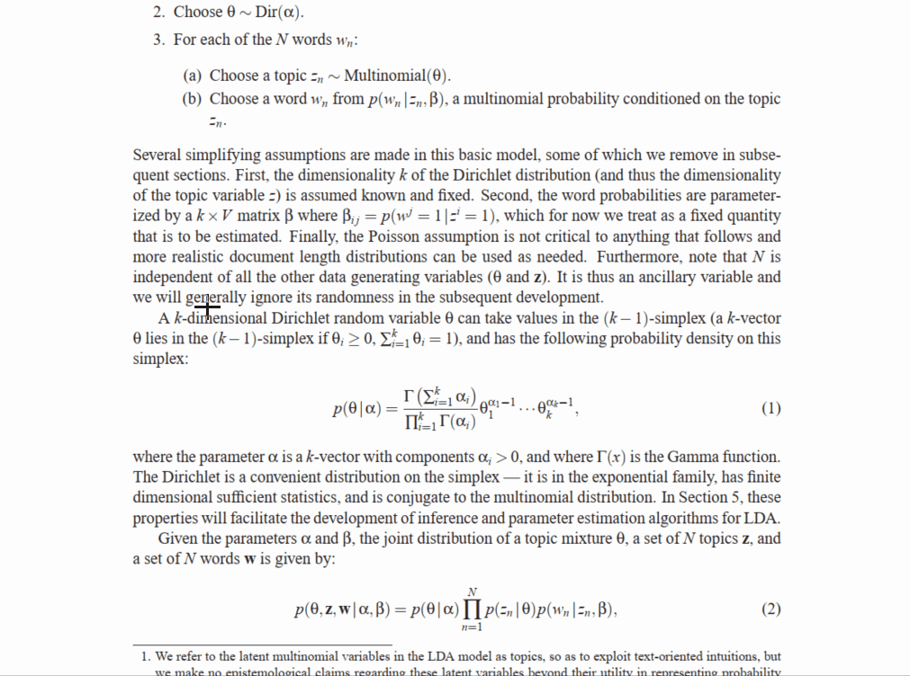

## About
Qapture is a PyQt porting of the desktop app called [Rapture](http://www.knystudio.net/rapture.html) (written in Japanese).  
It captures a specified area of your screen and display it on top of other windows.

While Rapture only supports Windows, Qapture is intended to be cross-platform.

## Usage
1. Run `main.py`.
2. Drag and drop to select a rectangular area in the desktop.
3. The screenshot of the selected area is displayed on a new window, which is fixed to the front.

## See also
* [Mapture](https://anatoo.jp/mapture/): Mac OS X counterpart of Rapture.
* [Kiritori](http://kiritori.ruhenheim.org/jp/): Similar to Mapture.